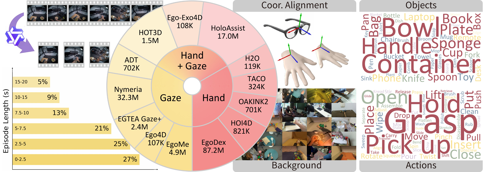

# GazeVLA: Learning Human Intention for Robotic Manipulation

<div align="center">

[]()
[](https://gazevla.github.io/)
[]()
[](./LICENSE)

</div>

</details>

---


This is the human data processing script used in the GazeVLA paper. It supports hand motion alignment and 2D & 3D visualization for egocentric human datasets, and additionally integrates latest datasets including xperience-10m, VITRA, and EgoScale. All data has been standardized and unified into a consistent format, aiming to contribute to the research community.


## 📋 Table of Contents
- [🛠 Environment Setup](#-environment-setup)
- [💡 Example](#-example)
- [🙏 Acknowledgements](#-acknowledgements)
- [✍️ Citation](#️-citation)

---


## 🛠 Environment Setup

### Step 1: Clone the Repository
```bash
git clone git@github.com:lichy2004/GazeVLA-Data.git GazeVLA-Data
cd GazeVLA-Data
```

### Step 2: Set Up Python Environment
```bash
# Create a conda environment
conda create -n gazevla_data python=3.11 -y
conda activate gazevla_data

# Install requirements
pip install -r requirements.txt
```

## 💡 Example
Each dataset includes three components: downloading, processing, and visualization. Here we take the EgoDex dataset as an example.

### downloading
```bash
cd data/EgoDex/download
bash download.sh
```

### processing
```bash
python src/dataset/EgoDex.py
```

### visualization
```bash
python examples/vis.py
```

## TODO

The following features are planned for future implementation:

✅ EgoDex
- [ ] HOT3D
- [ ] HoloAssist
- [ ] OAKINK2
- [ ] TACO
- [ ] HOI4D
- [ ] H2O
- [ ] xperience-10m
- [ ] VITRA
- [ ] EgoScale


##  🙏 Acknowledgements

Our code is built upon [Openpi](https://github.com/Physical-Intelligence/openpi) and [GraspVLA](https://github.com/PKU-EPIC/GraspVLA). These code serve as an essential foundation for our implementation, and we deeply appreciate the time, effort, and expertise they shared with the community.

## ✍️ Citation


If you find our work useful, please cite us:


```
@article{}
```

## License

 This work and the dataset are licensed under [CC BY-NC 4.0][cc-by-nc].

 [![CC BY-NC 4.0][cc-by-nc-image]][cc-by-nc]

 [cc-by-nc]: https://creativecommons.org/licenses/by-nc/4.0/
 [cc-by-nc-image]: https://licensebuttons.net/l/by-nc/4.0/88x31.png

<!-- *Chart updates automatically. Click to interact with the full timeline.* -->